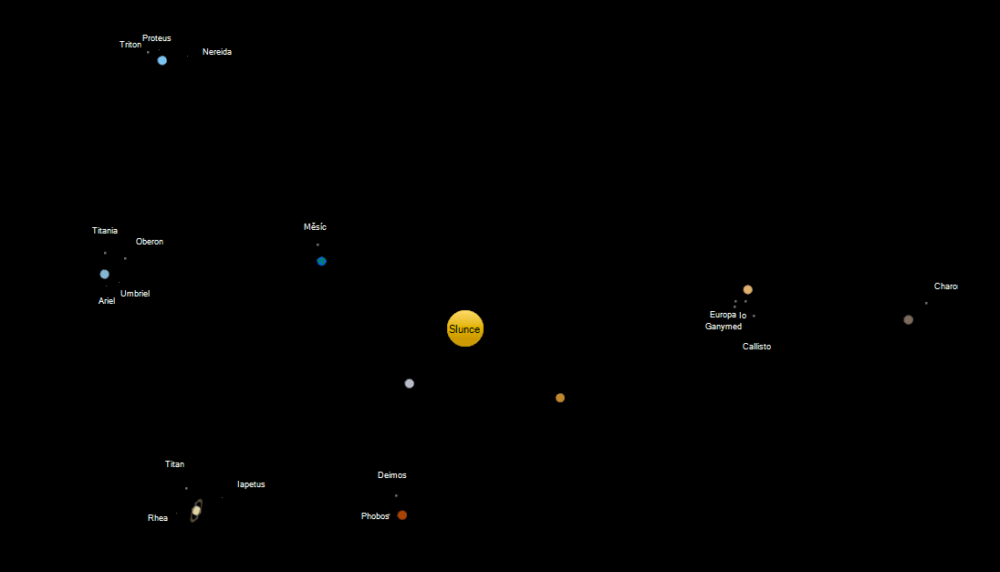

# Copernicus Solar system model

This is solar system animation I wrote back in May 2013 for a competition.
It can be used for example as a screensaver.

Speed of time can be adjusted and labels and trajectories can be toggled on/off.
